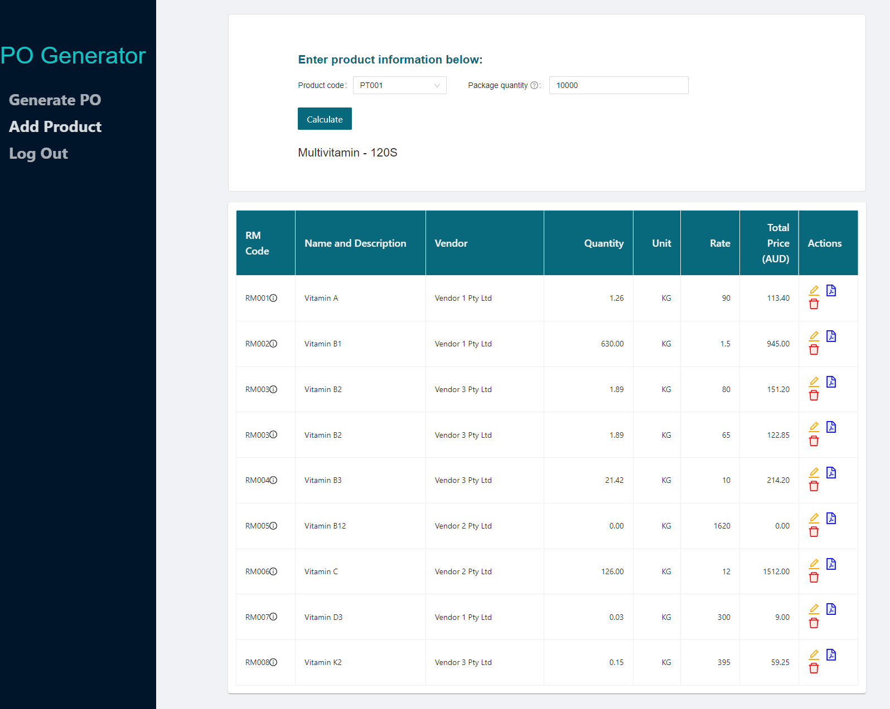

<h1>Purchase Order Generator</h1>
<!-- Table of content -->
<h2>Table of contents</h2>

* 1. [Summary](#Summary)
* 2. [Description](#Description)
* 3. [User-Story](#User-Story)
* 4. [Technologies](#Technologies)
* 5. [Link](#Link)
* 6. [Tests](#Tests)
* 7. [Screenshots](#Screenshots)
* 8. [Questions](#Questions) 

 

<h1>Summary</h1>

This purchase order (PO) generator was designed with the intention of automating a part of my employment core responsibility as a procurement officer, in a pharmaceutical manufactuting company.

<h1>Description</h1>

In a usual practical situation, the user will only be required to provide the type of product and the quantity as the only input, and the program handles the rest of the process including data extraction for all of the raw materials, calculation and PDF generation. As a result, the user will be able to obtain purchase order documents within a matter of seconds with minimum manual entry.
 
<h1>User-Story</h1>

- As a procurement officer,

- I want to minimize the time spent and the need of manual entry in creating PO’s,

- so I can be more productive and there is less chances for entry mistakes.

 
<h1>Technologies used</h1>

- <a href="https://www.educative.io/edpresso/what-is-mern-stack">M.E.R.N stack</a> (<a href="https://www.mongodb.com/">MongoDB</a>, <a href="https://expressjs.com/">ExpressJS</a>, <a href="https://reactjs.org/">ReactJS</a>, <a href="https://nodejs.org/en/about/">NodeJS</a>)

- <a href="https://ant.design/">Ant Design</a> (UI library)

- <a href="https://parall.ax/products/jspdf">jsPDF</a> (npm package for building PDF document template) 

 
<h1>Link</h1>

Heroku application: https://purchase-order-generator.herokuapp.com/

 
<h1>Tests</h1>

Use the following credentials for user authentication while using the application:

Email: c1@email.com

Password: 111

 
<h1>Screenshots</h1>
<h2>Purchase order calculation page</h2>
</img>
  
<h2>Add new products page</h2>
</img>
  
<h2>Login page</h2>
</img>
  
<h1>Questions</h1>

My Github profile: <a href="https://github.com/kvlin" class="col-12">https://github.com/kvlin</a>

My Email address: <a href = "mailto: kevlin129@hotmail.com">kevlin129@hotmail.com</a>

